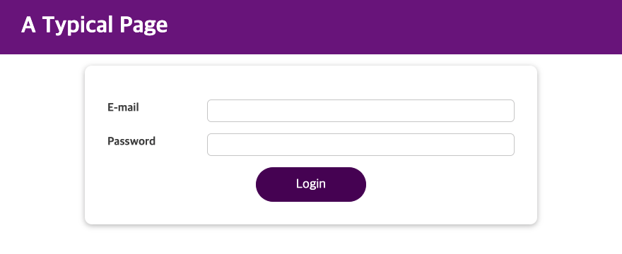
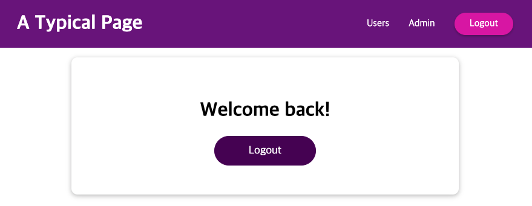

# Login / Logout System 

* #### writer : crystal Lee

* #### written at : 2022-05 

* #### source : [Udemy] React Perfect Guide Sec.10

---

* <strong>Skills</strong>
    * React 

 

* <strong>What I learn</strong>
    * useState 
    * useEffect 
    * useReducer 
    * useContext 
    * useRef 
        * & forwardRef & useImperativeHandle

 

* <strong>Features</strong>
    1. Login Form
        * email validitor
        * password validitor
        * when hitting Login Button, focus on invalid input 
    2. Logout 
    3. Nav bar changes depening on Login state

